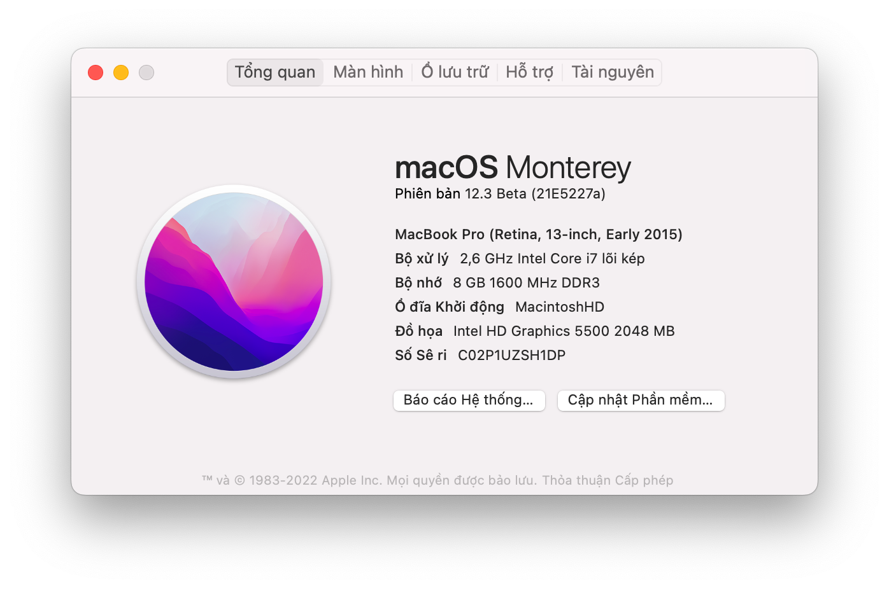

# ThinkPad X1C3 Hackintosh



[](https://developer.apple.com/documentation/macos-release-notes)
[](https://github.com/acidanthera/OpenCorePkg)
[](https://think.lenovo.com.cn/index.html)

### Hey

Mọi người dùng X1C3 hay T450/T450s X250 gì đó thì đều dùng được EFI này nha. Hiện mình đang dung X1C3 Monterey 12.1 + Opencore 076 khá ổn.BigSur, Catalina cũng hoạt động tốt, Mojave thì thỉnh thoảng văng ra màn hình nhập pass mà không biết fix hê hê. Nên tối ưu nhất chắc cứ ở Monterey là đẹp 🍉

## Hmmmmm

- Layout-id = 32 nha, Chạy ./install.sh trong ALCPlugFix để tai nghe không bị rè
- Cắm dock thì chuyển layout-id = 55
- Hỗ trợ màn hình cảm ứng
- Monterey, Big Sur, Catalina, Mojave ổn áp.
- support ThinkPad X250 ThinkPad T450 ThinkPad T450s ThinkPad X1 Carbon 3rd.

## Hardware information

```
- CPU：Intel Core i7-5600U i7-5600U i7-5500u i5-5300U i5-5200U

- The core graphics：Intel HD 5500 Graphics

- Sound card：ALC292

- Wifi：DW1820A  Intel 7265AC   Intel AX200   BCM943224
```

## Installation

<details>  
<summary><strong>BIOS Set up</strong></summary>
</br>

**BIOS (1.37):**

- Security -> Security Chip`: **Disabled**;
- Memory Protection -> Execution Prevention`: **Enabled**;
- Virtualization -> Intel Virtualization Technology`: **Enabled**;
- Internal Device Access -> Bottom Cover Tamper Detection`: must be **Disabled**;
- Anti-Theft -> Current Setting`: **Disabled**;
- Anti-Theft -> Computrace -> Current Setting`: **Disabled**;
- Secure Boot -> Secure Boot`: **Disabled**;
- UEFI/Legacy Boot`: **UEFI Only**;
- CSM Support`: **Yes**.

</details>

## State

<details>  
<summary><strong>What effective ✅</strong></summary>
</br>
 
- [x] CPUPower management
- [x] Intel HD 5500 Graphics 
- [x] The complete USB
- [x] camera
- [x] Sleep/wake up/shut down/restart
- [x] Intel Gigabit Ethernet (you can't use the Ethernet interface on your laptop after connecting to the docking station)
- [x] Wifi, Bluetooth, Airdrop, Handoff, Continuity     (Using intel-Wi-Fi may cause no sound after waking up)
- [x] iMessage, FaceTime, App Store, iTunes Store
- [x] Speaker and headphone jack    
- [x] Battery and complete battery information
- [x] Keyboard maps and hotkeys [ThinkpadAssistant](https://github.com/MSzturc/ThinkpadAssistant) 
- [x] The trackpad, the little red dot, and the physical button 
- [x] Support touch screen      (With multi-touch and touchscreen gestures)
- [x] mini DisplayPort
- [x] SD card reader    (Fixed by modifying the source code of [Sinetek-rtsx.kext](https://github.com/cholonam/Sinetek-rtsx/pull/18), for which I studied IOKit for a while)
- [x] Docking USB
- [x] Docking Ethernet
- [x] Docking Audio     ( Set layout-id of sound card to 55. )
- [x] Docking VGA
- [x] Docking DisplayPort
- [x] Docking DVI
- [x] Docking HDMI
- [x] Sidecar

</details>

<details>  
<summary><strong>What's not working ❌</strong></summary>
</br>

- [ ] VGA
- [ ] The fingerprint

</details>
